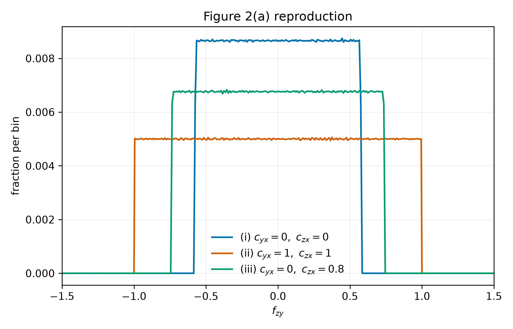
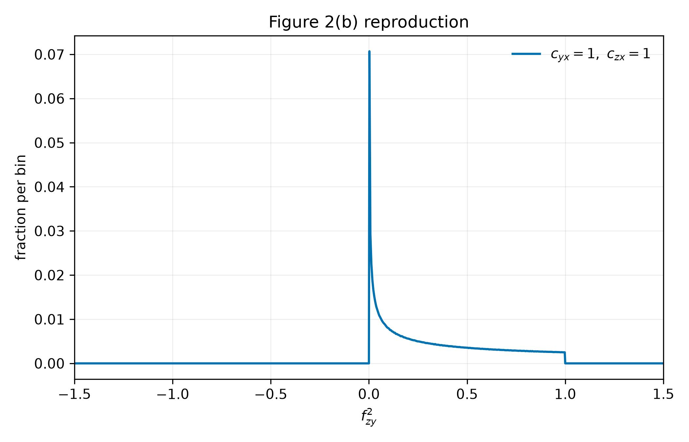
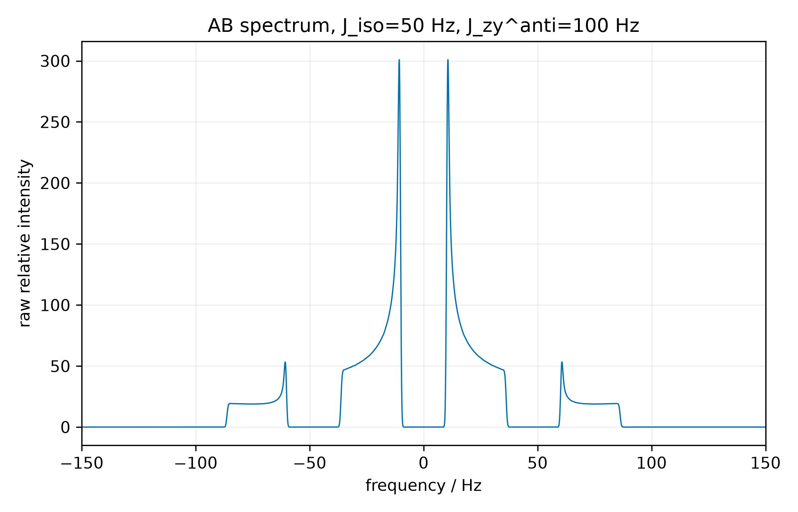

# AntisymmetricJ

AntisymmetricJ is a small Python package for calculating NMR spectra from tightly-coupled AB spin systems under MAS *including* the effects of antisymmetric J-coupling tensors. For theory, see Harris, Bryce, and
Wasylishen, Can. J. Chem. 87, 1338-1351 (2009). You can use this package to iteratively fit experimental spectra (I recommend double-quantum filtering to simplify the results).

Code follows the linear algebra setup of the original article:
crystallite axes are rotated into the rotor frame, projected into the plane
perpendicular to rotor-frame `z`, primed by a `-90 deg` rotation where equation
(11) requires it, and then combined into `f_zy`.

## Install

```bash
python -m pip install -e ".[dev]"
```

## Python Usage

```python
from antisymmetricj import f_zy, generate_zcw, weighted_distribution

orientations = generate_zcw()
values = f_zy(orientations.alpha, orientations.beta, c_yx=1.0, c_zx=1.0)
distribution = weighted_distribution(values, orientations.weights)

print(distribution.center)
print(distribution.fraction)
```

## Command Line

Generate a distribution directly with the default in-memory ZCW orientation set
of 28,656 orientations:

```bash
antisymmetricj calc_fzy distribution_outfile.txt --plot_fzy distribution.jpg --c-yx 1 --c-zx 1
```

Write a ZCW orientation file:

```bash
antisymmetricj make_zcw_set orientations_outfile.txt --min-orientations 832039
```

Process an explicit orientation file:

```bash
antisymmetricj calc_fzy orientations_infile.txt distribution_outfile.txt --c-yx 1 --c-zx 1
```

Calculate a Gaussian-broadened AB spectrum directly from the default in-memory
ZCW orientation set:

```bash
antisymmetricj calc_spectrum spectrum_outfile.txt \
  --sigma-i-hz 60 \
  --sigma-s-hz 10 \
  --j-iso-hz 50 \
  --j-zy-anti-hz 100 \
  --c-yx 1 \
  --c-zx 1 \
  --fwhm-hz 1.0 \
  --plot_spectrum spectrum.jpg
```


## Examples

Generate the Figure 2 reproduction artifacts with the explicit example script:

```bash
PYTHONPATH=src python examples/reproduce_figure2.py
```

## Figure 2 Outputs

The example writes:

- `examples/output/figure2a_intensities.txt`
- `examples/output/figure2a.jpg`
- `examples/output/figure2b_intensities.txt`
- `examples/output/figure2b.jpg`

After running the example, the generated images are:





The spectrum example above generates:



## Development

```bash
ruff check .
black --check .
isort --check-only .
mypy src
pytest
python -m build
```

## License

MIT.
